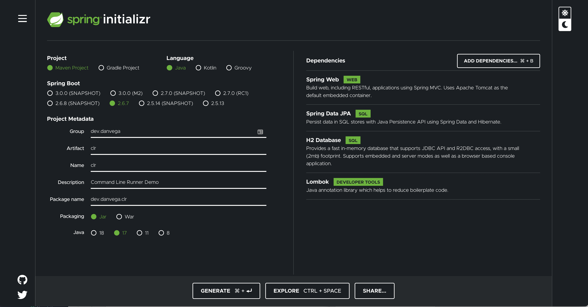
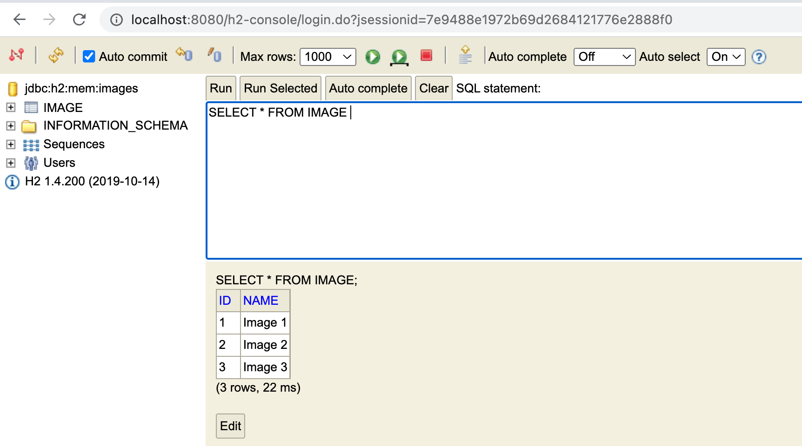

<div class="callout">💡 The video tutorial for this blog post can be found above or you can <a href="https://youtu.be/gBN8x4yN5Ks">click here</a> to watch it on YouTube.</div>

A student asked me the other day what a Command Line Runner was and when can we use one. If you watch demos of Spring Boot features or applications you have probably seen this and said to yourself "What the heck is that?". If you take a look a look at the API Documentation for Command Line Runner you will get this elegant explanation.

> Interface used to indicate that a bean should _run_ when it is contained within a SpringApplication. Multiple CommandLineRunner beans can be defined within the same application context and can be ordered using the Ordered interface or @Order annotation.

In this article, I will explain what a Command Line Runner is and what you might use it for in your next Spring Boot application.

## Command Line Runner

A command-line runner is an interface that you can implement to execute some code before the application starts up. If we define an implementation of the Command Line Runner interface you will need to override the `run()` method. This method will be executed after the application context is loaded and right before the Spring Application run method is completed.

Start by creating a new application with the Spring Initalizr and select the following dependencies:



Before we dive in and create one we should talk about some of the things you might want to use this for. Remember that this going to execute after the application context is loaded so you could use it to check if certain beans exist or what values of certain properties are.  Another reason to use it is to load some data right before your application fires up. I will say that I have used a Command Line Runner for these purposes before but they were both in development or demo environments.

### Command Line Runner Demo

In this demo, you are going to create a DataLoader class that is going to load some initial demo data into your application. For demo purposes you are creating a web application with JPA & H2. The first thing you ned to do is open up `application.properties` and add the following to establish a connection to the H2 database:

```
spring.h2.console.enabled=true
spring.datasource.generate-unique-name=false
spring.datasource.name=images
```

Next you will need to create a simple `@Entity` class named Image. This class will represent an image but the constructor simply takes a String for the image name. You aren't working any real images in this demo.

```java
@Entity
@Data
@NoArgsConstructor
public class Image {

    @Id @GeneratedValue
    private Long id;
    private String name;

    public Image(String name) {
        this.name = name;
    }
}
```

When your application starts up you want to load a couple of images into your database. You could place a SQL script in the resources folder, but who wants to write SQL from scratch? 🤦‍♂️ To persist data to the database create a new interface called `ImageRepository` and extend the `CrudRepository` interface which will provide you with CRUD methods.

```java
public interface ImageRepository extends CrudRepository<Image,Long> {

}
```

Now that you have a way to persist data you can create a new class called `DataLoader` that will be responsible for loading the data. This class is going to implement the `CommandLineRunner` interface and override the run method. The other important thing to note here is that you need to annotate the class with `@Component` or Spring will never find it and call the run method.

```java
@Component
public class DataLoader implements CommandLineRunner {

    private final Logger logger = LoggerFactory.getLogger(DataLoader.class);

    @Override
    public void run(String... strings) throws Exception {
        logger.info("Loading data...");
    }
}
```

Now let's work on persisting some data into a database. In the run method you will create a list of 3 images with simple names. With a list of images you can call the repositories `saveAll()` method which takes an Iterable of entities.

```java
@Component
public class DataLoader implements CommandLineRunner {

    private final Logger logger = LoggerFactory.getLogger(DataLoader.class);
    private final ImageRepository repository;

    public DataLoader(ImageRepository repository) {
        this.repository = repository;
    }

    @Override
    public void run(String... args) throws Exception {
        logger.info("Loading data...");
        List<Image> images = List.of(new Image("Image 1"), new Image("Image 2"), new Image("Image 3"));
        repository.saveAll(images);
    }
}
```

If you start the application and look at the [H2 console](http://localhost:8080/h2-console) you will see the new database rows.



### Command Line Runner Functional Interface

If you look at the source code for the `CommandLineRunner` interface you will see that it has a single method called `run()` and is marked as a `@FunctionalInterface`.

```java
@FunctionalInterface
public interface CommandLineRunner {

	/**
	 * Callback used to run the bean.
	 * @param args incoming main method arguments
	 * @throws Exception on error
	 */
	void run(String... args) throws Exception;

}
```

This means that this is a candidate for a lambda expression. This means that instead of creating a whole new class you can just create a method and annotate it with `@Bean` so that Spring will find it. The following Command Line Runner is in the main application class and does the same thing as the class you created before.

```java
@SpringBootApplication
public class Application {

    public static void main(String[] args) {
        SpringApplication.run(Application.class, args);
    }

    @Bean
    public CommandLineRunner runner(ImageRepository repository) {
        return args -> {
            List<Image> images = List.of(new Image("Image 1"), new Image("Image 2"), new Image("Image 3"));
            repository.saveAll(images);
        };
    }

}
```

### Multiple Command Line Runners

What if you wanted to create 2 Command Line Runners that did contained completely separate logic? No problem, just use the annotation Order to specify the order in which they should run.

```java
@Component
@Order(1)
public class AnotherDataLoader implements CommandLineRunner {

    private final Logger logger = LoggerFactory.getLogger(DataLoader.class);
    private final ImageRepository repository;

    public AnotherDataLoader(ImageRepository repository) {
        this.repository = repository;
    }

    @Override
    public void run(String... args) throws Exception {
        logger.info("Loading data from AnotherDataLoader...");
        List<Image> images = List.of(new Image("Image 4"), new Image("Image 5"), new Image("Image 6"));
        repository.saveAll(images);
    }
}
```

```java
@Component
@Order(2)
public class DataLoader implements CommandLineRunner {

    private final Logger logger = LoggerFactory.getLogger(DataLoader.class);
    private final ImageRepository repository;

    public DataLoader(ImageRepository repository) {
        this.repository = repository;
    }

    @Override
    public void run(String... args) throws Exception {
        logger.info("Loading data from DataLoader...");
        List<Image> images = List.of(new Image("Image 1"), new Image("Image 2"), new Image("Image 3"));
        repository.saveAll(images);
    }
}
```

If we look in the console we can see that Another Database Loader ran first.


## Conclusion

I hope this helped clear up some confusion on what a Command Line Runner is and how to use it. If you want to checkout the code for this demo you will find it over on [Github](https://github.com/danvega/command-line-runner). If you're already using a Command Line Runner in your applications I would like to leave you with this question to kick start a discussion.

_**Question:** What are some other uses for a Command Line Runner?_

