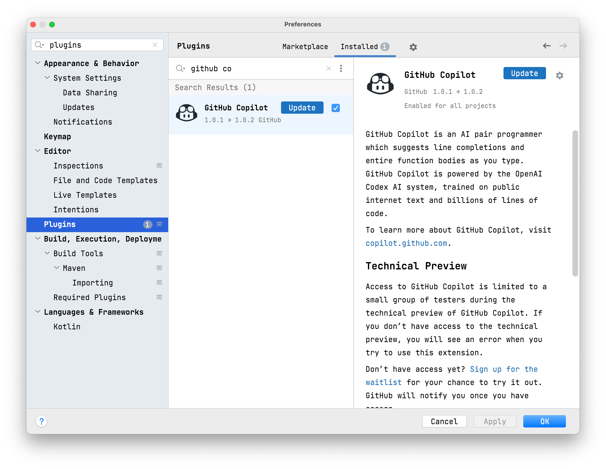

💡 The video tutorial for this blog post can be found above or you can [click here](https://youtu.be/97C3fQqzj-I) to watch it on YouTube.

Earlier this year GitHub launched Copilot, an AI pair-programmer. With GitHub Copilot, get suggestions for whole lines or entire functions right inside your editor. I'm not sure if it supported Java when it was first launched but at the time of writing this, the technical preview supports Python, JavaScript, TypeScript, Ruby, Java & Go.

When it was released back in June of 2021 they only had support for Visual Studio Code. At Github Universe 2021 they announced support for NeoVim and Jetbrains. This means that if you're running any flavor of the JetBrains IDE like IntelliJ, GoLand, or Webstorm you can use Github Copilot.

In this tutorial, I am focused on Github Copilot for Java Developers. I am using IntelliJ Ultimate Edition but this should work fine in the community edition. The first thing you need to do is to visit [https://copilot.github.com](https://copilot.github.com/) and sign up for the technical preview. Next, open up IntelliJ and go to `Preferences > Plugins`, search for Github Copilot and install the plugin.

At this point, you're ready to use GitHub Copilot. In the remainder of the video tutorial, I walk through different ways GitHub Copilot was able to make suggestions for lines of code and even entire methods. If you want to grab the final code you can head over to the repository below.

[https://github.com/danvega/youtube/tree/main/java/github-copilot](https://github.com/danvega/youtube/tree/main/java/github-copilot)

## Conclusion

As I said throughout the video I am not sure how this is going to work into my day-to-day workflow. Since the video was made I have been using it a little bit more and I can say that it's not replacing me, it's actually assisting me in writing code faster.
